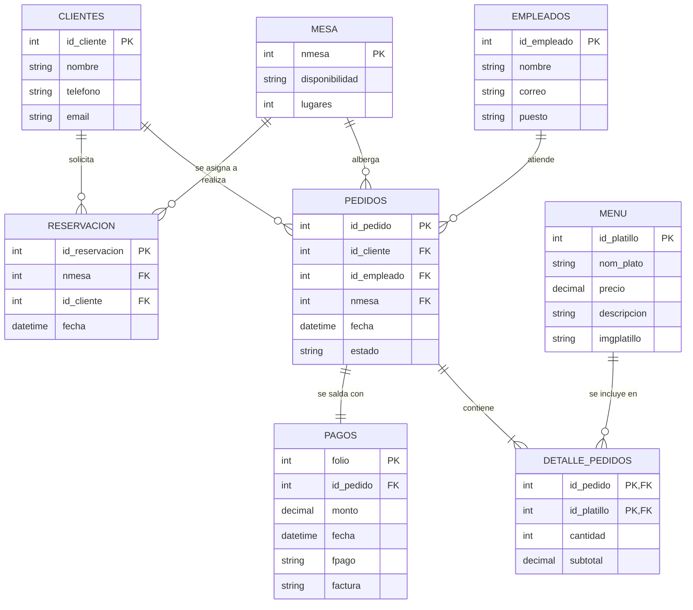

# Equipo XX — Esquema relacional del proyecto

**Dominio de negocio:**

**Integrantes:**
-
-
-

**Enlace al diagrama E/R del jueves 17** (dbdiagram.io, Mermaid o archivo en el repositorio del proyecto):

---

## 1. Esquema relacional

<!-- Transformen su E/R completo con la notación de guias/notacion.md.
     Todas las tablas, todas las PK, todas las FK y el ? donde corresponda. -->
MENU(**id_platillo**, nom_plato, precio, descripcion?, imgplatillo?)

CLIENTES(**id_cliente**, nombre, telefono, email? UNIQUE)

MESA(**nmesa**, disponibilidad, lugares)
EMPLEADOS(**id_empleado**, nombre, correo UNIQUE, puesto)

RESERVACION(**id_reservacion**, nmesa → MESA, id_cliente → CLIENTES, fecha)

PEDIDOS(**id_pedido**, id_cliente → CLIENTES, id_empleado → EMPLEADOS, nmesa → MESA, fecha, estado)

DETALLE_PEDIDOS(**id_pedido** → PEDIDOS, **id_platillo** → MENU, cantidad, subtotal)

PAGOS(**folio**, id_pedido → PEDIDOS UNIQUE, monto, fecha, fpago, factura?)
```

```
## Diagrama
## Diagrama E/R - Sistema de Restaurante


## 2. Relaciones N:M y cómo las resolvieron

| Relación en el E/R | Tabla intermedia | Llave primaria de la tabla intermedia | ¿Se puede repetir la misma pareja? ¿Por qué? |
| :--- | :--- | :--- | :--- |
| **SOCIO – CLASE** | INSCRIPCION | (num_socio, id_clase, fecha_inscripcion) | **Sí.** Un socio puede darse de baja de una clase y volverse a inscribir en otra fecha distinta, por lo que la `fecha_inscripcion` forma parte de la PK para permitir re-inscripciones históricas. |

## 3. Relaciones 1:1, recursivas, débiles y multivaluados

| Caso | Dónde aparece en su E/R | Cómo lo resolvieron |
| :--- | :--- | :--- |
| **Relación 1:1** | SOCIO – LOCKER | La FK `num_socio` va en `LOCKER` y es `UNIQUE` y opcional (`?`), así un socio tiene a lo más un locker y un locker pertenece a lo más a un socio. |
| **Relación recursiva** | INSTRUCTOR – INSTRUCTOR | La FK `supervisor` apunta a la PK `num_empleado` dentro de la misma tabla `INSTRUCTOR` y es opcional (`?`) para la coordinadora general. |
| **Entidad débil** | SESION, que depende de CLASE | Se creó una tabla con PK compuesta (`id_clase` -> CLASE, `numero_sesion`). Su discriminador o llave parcial es `numero_sesion`. |
| **Atributo multivaluado** | Teléfonos de contacto del socio | Se extrajo el atributo multivaluado creando la tabla `TELEFONOS_SOCIO` con PK compuesta (`num_socio` -> SOCIO, `telefono`). |


## 4. Llaves foráneas que admiten NULL

<!-- Toda FK con ? necesita una razón de negocio. -->

| Tabla.columna | Por qué puede quedar vacía |
|---|---|
| |Ninguna. Todas las llaves foráneas son obligatorias:
- RESERVACION: nmesa, id_cliente (toda reservación tiene mesa y cliente)
- PEDIDOS: id_cliente, id_empleado, nmesa (todo pedido tiene cliente, empleado y mesa)
- DETALLE_PEDIDOS: id_pedido, id_platillo (forman la llave primaria)
- PAGOS: id_pedido (todo pago pertenece a un pedido) |

## 5. Cambios respecto del E/R del jueves

<!-- Al pasar a tablas casi siempre aparece algo que el E/R no dejaba ver.
     Si cambiaron algo del diagrama, díganlo aquí. Si no cambiaron nada, escriban "Ninguno". -->

-• No hubo cambios estructurales: las 8 entidades y sus relaciones (1:N y 1:1) se conservaron.

 • DETALLE_PEDIDOS (entidad débil en el E/R) quedó como tabla con llave primaria compuesta (id_pedido, id_platillo), donde ambas columnas son llaves foráneas.
 
 
  • La relación 1:1 Pedidos–Pagos se resolvió con id_pedido como FK UNIQUE en PAGOS.
  
   • Se estandarizaron nombres de atributos (por ejemplo, ID_Platilo pasó a id_platillo). 
