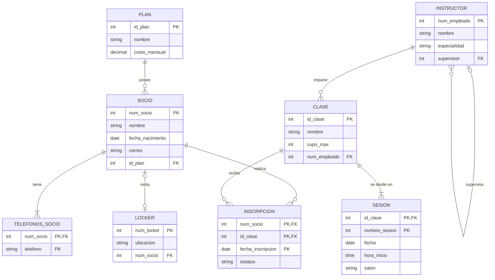

# Equipo XX — Caso Gimnasio

**Integrantes:**
-Luis Fernando Zaldivar Plata
-Sergio Ituriel Hernandez Escalona
-Irene Karina Martinez Solis

## Esquema relacional

<!-- Usen la notación de guias/notacion.md. Una tabla por renglón. -->

```
PLAN(**id_plan**, nombre, costo_mensual)
SOCIO(**num_socio**, nombre, fecha_nacimiento, correo?, id_plan → PLAN)
TELEFONOS_SOCIO(**num_socio** → SOCIO, **telefono**)
LOCKER(**num_locker**, ubicacion, num_socio? → SOCIO UNIQUE)
INSTRUCTOR(**num_empleado**, nombre, especialidad, supervisor? → INSTRUCTOR)
CLASE(**id_clase**, nombre, cupo_max, num_empleado → INSTRUCTOR)
SESION(**id_clase** → CLASE, **numero_sesion**, fecha, hora_inicio, salon)
INSCRIPCION(**num_socio** → SOCIO, **id_clase** → CLASE, **fecha_inscripcion**, estatus)

```

## Diagrama (opcional)

<!-- Si quieren, dibujen aquí el esquema en Mermaid. -->
## Diagrama E/R - Caso Gimnasio



